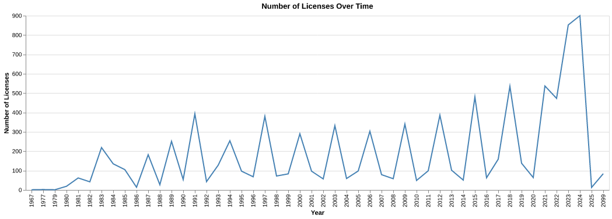
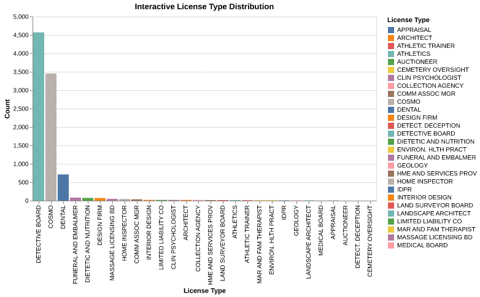

# HW5.2 – Data Visualization

## Links
- [The Data](https://raw.githubusercontent.com/UIUC-iSchool-DataViz/is445_data/main/licenses_fall2022.csv)
- [The Analysis](https://github.com/roqayaelmenshawy2/hw5-is445/blob/main/Workbook.ipynb)

---

## Visualization 1: Licenses Over Time

The first visualization shows how the number of licenses changes over time by plotting the total count of licenses for each year based on the expiration date. I used a line chart because it clearly shows trends over time. The x-axis represents year (ordinal), and the y-axis shows the count (quantitative). I used a single color (steel blue) to keep the focus on the trend.  

To prepare the data, I converted the expiration date column into a datetime format and extracted the year. I also removed missing values to ensure accurate results.

---

## Visualization 2: License Type Distribution (Interactive)

This visualization shows the distribution of license types using a bar chart. The x-axis encodes license type (nominal), and the y-axis encodes count. I used color to differentiate categories and highlight selected values.  

The bar chart makes it easy to compare categories and identify the most common license types.

---

## Interactivity

I added interactivity using Altair’s selection_point(). Users can click on a bar to highlight it while others fade to gray. This makes it easier to focus on one category at a time and improves readability.

---

## Visualizations

### Chart 1

### Chart 2

